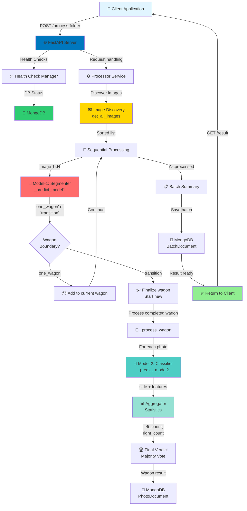
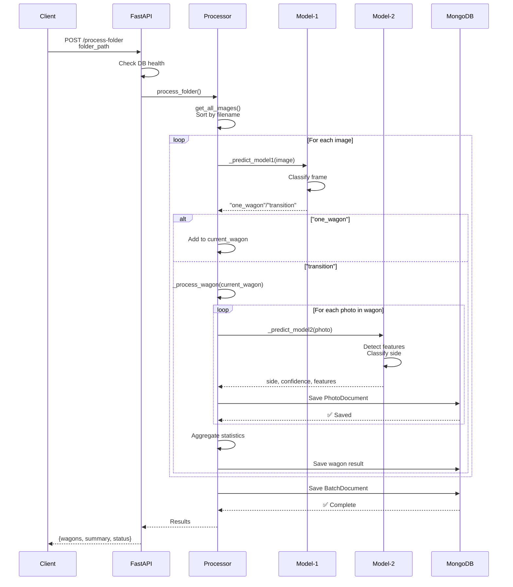
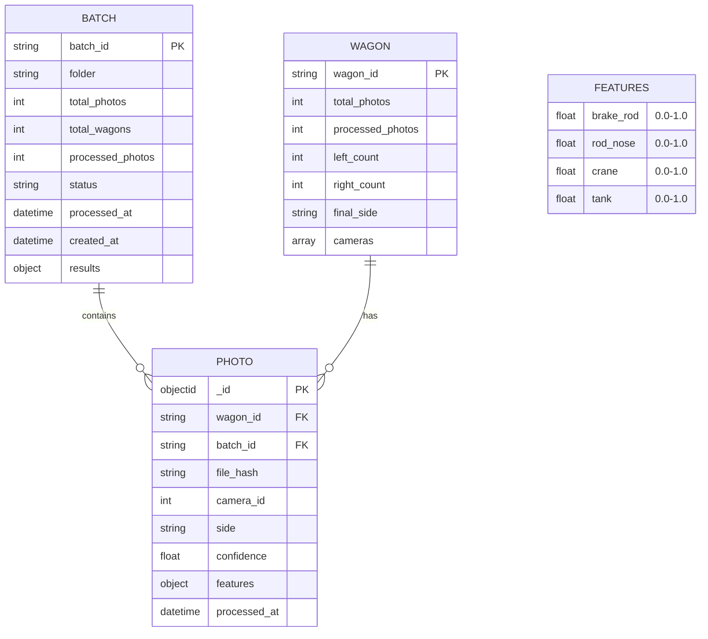
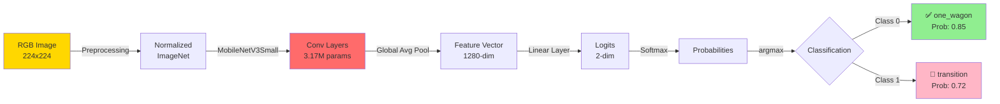
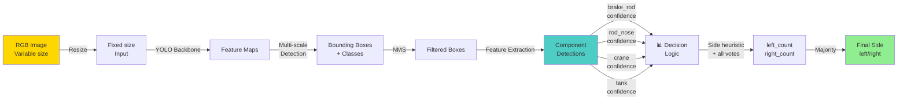
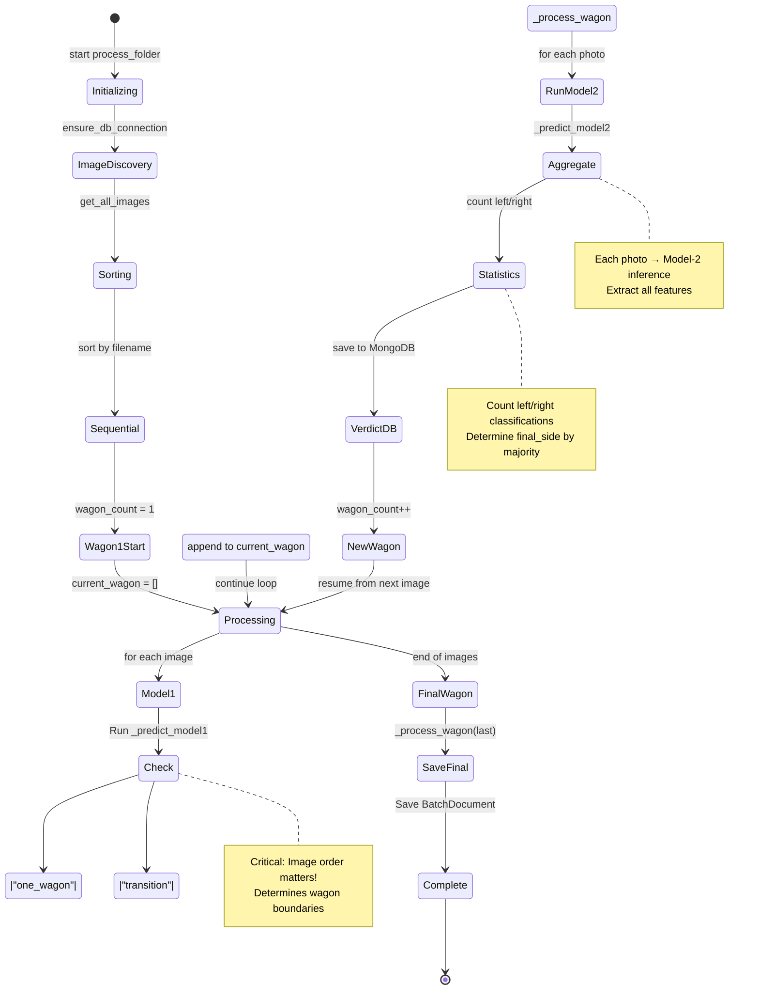
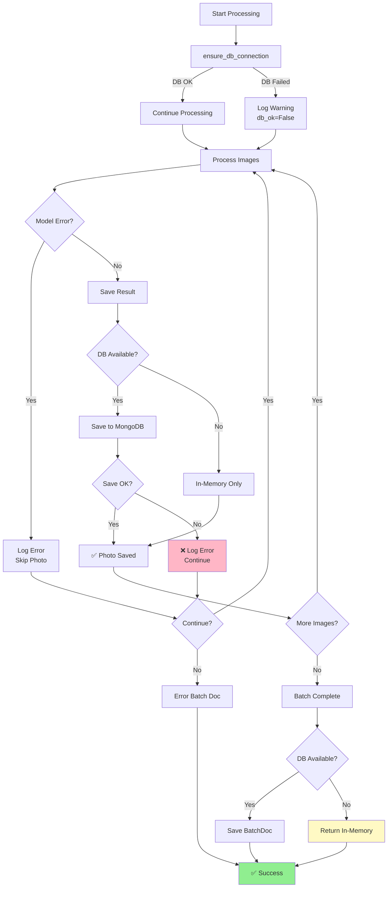
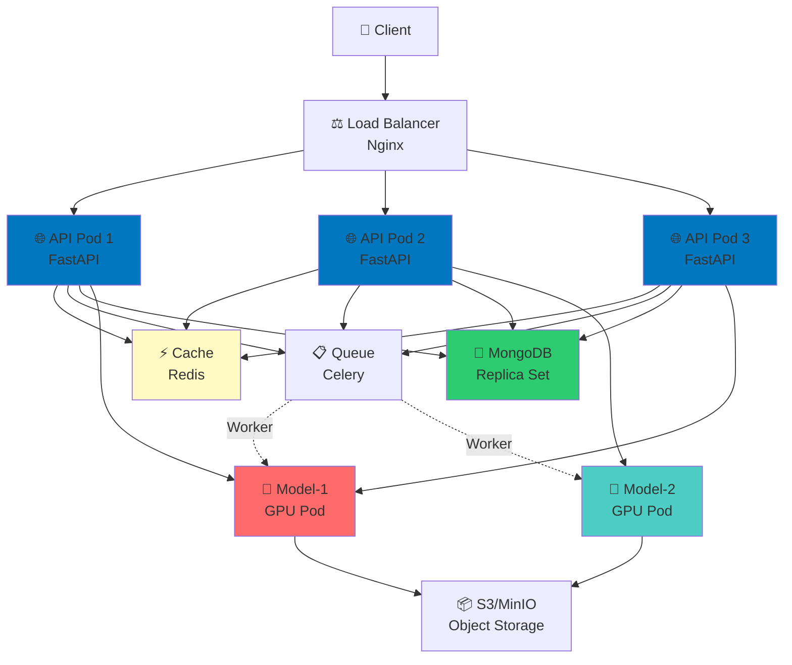
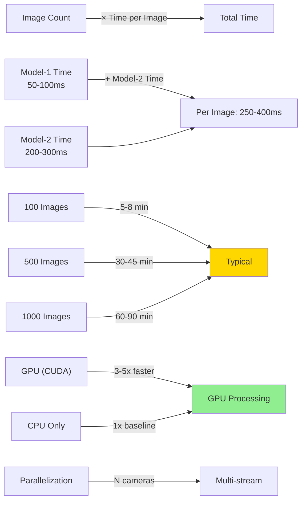

<!-- 🏛️ System architecture and component interactions -->
# System Architecture 

## Data Flow Diagram



## Component Interaction



## Data Schema Relationships



## Model-1: Wagon Segmentation



## Model-2: Side Classifier



## Processing Pipeline State Machine



## Error Handling Flow



## Deployment Architecture



---

## Call Flow Examples

### Successful Processing

```
1. Client sends folder path
   POST /process-folder {folder: "/test/camera_2"}

2. FastAPI receives request
   - Checks /health/db → Connected ✅
   - Spawns processor task

3. Processor starts
   - ensure_db_connection() → True
   - get_all_images() → [image1, image2, ..., image_N] (sorted)
   - Creates batch_id

4. For each image:
   - Model-1: "one_wagon" (frames 1-10)
   - Model-1: "one_wagon" (frames 11-20)
   - Model-1: "transition" (frame 21)
     → Triggers _process_wagon("wagon_1", frames_1-20)
   - Model-2: side=left (frame 1) → left_count++
   - Model-2: side=right (frame 2) → right_count++
   - ... aggregate all 20 frames
   - Save wagon_1 result + PhotoDocuments

5. Continue with wagon_2, wagon_3...

6. All wagons processed:
   - Save BatchDocument with all results
   - Return to client: {batch_id, wagons, summary, status}

7. Client polls GET /result/{batch_id}
   - Returns complete results from MongoDB
```

### DB Unavailable Scenario

```
1. Client sends folder path
   POST /process-folder {folder: "/test"}

2. FastAPI receives request
   - Checks /health/db → NOT Connected ⚠️
   - Sets db_ok=False
   - But continues processing!

3. Processor processes all images
   - All computations work normally

4. When saving results:
   - If db_ok=False: Skip MongoDB save
   - Results stored in memory
   - Return to client with results

5. Client gets full results without DB
   - Can retry later if DB comes back online
   - Results still valid but not persisted
```

---

## Performance Characteristics



---

*Architecture diagrams created: February 24, 2026*
